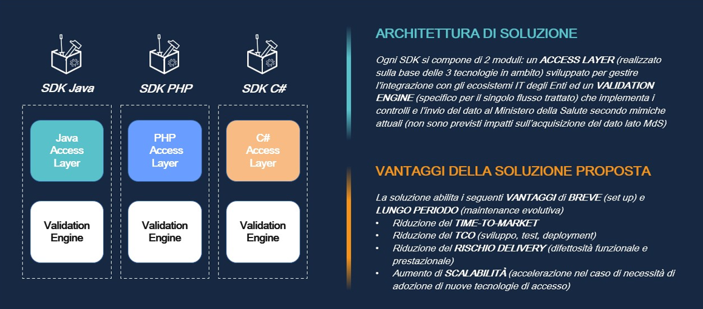

# **1 Introduzione**

## ***1.1 Obiettivi del documento***

Il Ministero della Salute (MdS) metterà a disposizione degli Enti, da cui riceve dati, applicazioni SDK specifiche per flusso logico e tecnologie applicative (Java, PHP e C#) per verifica preventiva (in casa Ente) della qualità del dato prodotto.

Nel presente documento sono fornite la struttura e la sintassi dei tracciati previsti dalla soluzione SDK per avviare il proprio processo elaborativo, nonché i relativi schemi xsd di convalida e i controlli di merito sulla qualità, completezza e coerenza dei dati.

Gli obiettivi del documento sono:

- fornire una descrizione funzionale chiara e consistente dei tracciati di input a SDK;
- fornire le regole funzionali per la verifica di qualità, completezza e coerenza dei dati;

In generale, la soluzione SDK è costituita da 2 diversi moduli applicativi (Access Layer e Validation Engine) per abilitare

- l’interoperabilità con il contesto tecnologico dell’Ente in cui la soluzione sarà installata;
- la validazione del dato ed il suo successivo invio verso il MdS.

La figura che segue descrive la soluzione funzionale ed i relativi benefici attesi.

## ***1.2 Acronimi***

Nella tabella riportata di seguito sono elencati tutti gli acronimi e le definizioni adottati nel presente documento.

|**#**|**Acronimo / Riferimento**|**Definizione**|
| - | - | - |
|1|NSIS|Nuovo Sistema Informativo Sanitario|
|2|SDK|Software Development Kit|
|3|SISM|Sistema Informativo Salute Mentale|

# **2. Architettura SDK**

L'architettura degli SDK è disponibile al seguente link [`ARCHITECTURE.md`](https://github.com/ministero-salute/sdk-utilities-regole-properties/blob/main/ARCHITECTURE.md).

# **3. Funzionamento della soluzione SDK**

In questa sezione è descritta le specifica di funzionamento del flusso **ANT**  per l’alimentazione dello stesso.

## ***3.1 Input SDK***

In fase di caricamento del file verrano impostati i seguenti parametri che andranno in input al SDK in fase di processamento del file:

|**NOME PARAMETRO**|**DESCRIZIONE**|**LUNGHEZZA**|**DOMINIO VALORI**|
| :- | :- | :- | :- |
|ID CLIENT|Identificativo univoco della transazione che fa richiesta all'SDK|100|Non definito|
|NOME FILE INPUT|Nome del file per il quale si richiede il processamento lato SDK|256|Non definito|
|ANNO RIFERIMENTO|Stringa numerica rappresentante l’anno di riferimento per cui si intende inviare la fornitura|4|Anno (Es. 2022)|
|PERIODO RIFERIMENTO|Stringa alfanumerica rappresentante il periodo per il quale si intende inviare la fornitura. In fase di invio della fornitura verso Mds si dovrà concatenare al valore di questo campo il carattere I (i MAIUSCOLA) (Es. S1I)|2|S1, S2|
|TIPO TRASMISSIONE |Indica se la trasmissione dei dati verso MDS avverrà in modalità full (F) o record per record (R). Per questo flusso la valorizzazione del parametro sarà impostata di default a F|1|F/R|
|FINALITA’ ELABORAZIONE|Indica se i flussi in output prodotti dal SDK verranno inviati verso MDS (Produzione) oppure se rimarranno all’interno del SDK e il processamento vale solo come test del flusso (Test)|1|Produzione/Test|
|CODICE REGIONE|
Individua la Regione a cui afferisce la struttura. Il codice da utilizzare è quello a tre caratteri definito con DM 17 settembre 1986, pubblicato nella Gazzetta Ufficiale n.240 del 15 ottobre 1986, e successive modifiche, utilizzato anche nei modelli per le rilevazioni delle attività gestionali ed economiche delle Aziende unità sanitarie locali.

|3|Es. 010|

## ***3.2 Tracciato input a SDK***

Il flusso di input avrà formato **csv** posizionale e una naming convention libera a discrezione dell’utente che carica il flusso senza alcun vincolo di nomenclatura specifica (es: nome\_file.csv). Il separatore per il file csv sarà la combinazione di caratteri tra doppi apici: “~“.

All’interno della specifica del tracciato sono indicati i dettagli dei campi di business del tracciato di input atteso da SDK, il quale differisce per i diversi flussi dell’area SISM. All’interno di tale file è presente la colonna **Posizione nel file** la quale rappresenta l’ordinamento delle colonne del tracciato di input da caricare all’SDK.

Di seguito la tabella in cui è riportata la specifica del tracciato di input per il flusso in oggetto:

|**Nome campo**|**Posizione nel File**|**Key**|**Descrizione**|**Tipo** |**Obbligatorietà**|**Informazioni di Dominio**|**Lunghezza campo**|**XPATH Tracciato Output**|
| :-: | :-: | :-: | :-: | :-: | :-: | :-: | :-: | :-: |
|Anno di riferimento|1|KEY|Indica l’anno a cui si riferisce la rilevazione.|N|OBB|Formato AAAA|4|/TerritorialeAnagrafica/AnnoRiferimento|
|Codice Regione|2|KEY|Individua la Regione a cui afferisce la struttura. Il codice da utilizzare è quello a tre caratteri definito con DM 17 settembre 1986, pubblicato nella Gazzetta Ufficiale n.240 del 15 ottobre 1986, e successive modifiche, utilizzato anche nei modelli per le rilevazioni delle attività gestionali ed economiche delle Aziende unità sanitarie locali.|AN|OBB|Riferimento: Allegato 1|3|/TerritorialeAnagrafica/CodiceRegione|
|Periodo di Riferimento|3|KEY|Indica il semestre a cui si riferisce la rilevazione.|AN|OBB|Valori Accettati • S1 • S2|2|/TerritorialeAnagrafica/PeriodoRiferimento|
|Codice Azienda Sanitaria di Riferimento|4|KEY|Identifica l’azienda sanitaria locale in cui e’ sito il Servizio. Il codice da utilizzare è quello a tre caratteri usato anche nei modelli per le rilevazioni delle attività gestionali ed economiche delle Aziende unità sanitarie locali (codici di cui al D.M. 05/12/2006 e successive modifiche).|AN|OBB|Riferimento: MRA (Monitoraggio Rete Assistenza)|3|/TerritorialeAnagrafica/AziendaSanitariaRiferimento/CodiceAziendaSanitariaRiferimento|
|Codice Dipartimento Salute Mentale|5|KEY|Identifica il dipartimento di Salute Mentale interessato alla rilevazione.|AN|OBB| |3|/TerritorialeAnagrafica/AziendaSanitariaRiferimento/DSM/CodiceDSM|
|Id Record|6|KEY|Codice identificativo unico del record |AN|OBB|Il valore deve essere generato come descritto nel par. 2.2.3.3.2 - Codice identificativo unico del record (ID\_REC) – modalità di alimentazione|88|/TerritorialeAnagrafica/AziendaSanitariaRiferimento/DSM/Assistito/Id\_Rec|
|CUNI|7| |Identificativo unico non invertibile dell’assistito |AN|OBB|Il campo deve essere valorizzato con il codice identificativo dell’assistito generato come descritto nel par. 2.2.3.3.1- CUNI – modalità di alimentazione|88|/TerritorialeAnagrafica/AziendaSanitariaRiferimento/DSM/Assistito/CUNI|
|Validità del codice Identificativo dell'assistito|8| |Informazione relativa alla validità del codice identificativo dell'assistito recuperata a seguito della chiamata al servizio di validazione esposto dal sistema TS del MEF|N|OBB|I valori ammessi sono: 0 - Codice identificativo valido (presente in banca dati MEF)  1 - Codice identificativo errato (non presente in banca dati MEF)|1|/TerritorialeAnagrafica/AziendaSanitariaRiferimento/DSM/Assistito/validitaCI|
|Tipologia del codice Identificativo dell'assistito|9| |Informazione relativa alla tipologia del codice identificativo dell'assistito recuperata a seguito della chiamata al servizio di validazione esposto dal sistema TS del MEF|N|OBB|I valori ammessi sono: 0 - Codice Fiscale,  1 - Codice STP,  2 - Codice ENI,  3 - Codice TEAM,  4 - codice fiscale numerico provvisorio a 11 cifre, 99 - Codice non presente in banca dati|2|/TerritorialeAnagrafica/AziendaSanitariaRiferimento/DSM/Assistito/tipologiaCI|
|Anno di Nascita|10| |Identifica l’anno di nascita dell’assistito, il formato da utilizzare è il seguente: AAAA. L’età dell’assistito nell’anno della rilevazione del dato deve essere compresa tra i 18 ed i 100 anni.|N|OBB|Formato: AAAA|4|/TerritorialeAnagrafica/AziendaSanitariaRiferimento/DSM/Assistito/AnnoNascita|
|Sesso|11| |Identifica il sesso anagrafico dell’assistito. E’ necessario riportare l’informazione più aggiornata al termine del periodo di riferimento della rilevazione. |N|OBB|Valori Ammessi: 1=MASCHIO 2=FEMMINA 9=NON NOTO/NON RISULTA|1|/TerritorialeAnagrafica/AziendaSanitariaRiferimento/DSM/Assistito/Sesso|
|Cittadinanza |12| |Identifica la cittadinanza dell’assistito a cui è stata erogata la prestazione. La codifica da utilizzare è quella Alpha2 (a due lettere) prevista dalla normativa ISO 3166. E’ necessario riportare l’informazione più aggiornata al termine del periodo di riferimento della rilevazione.|A|OBB|Valore Ammesso: Codice Alpha 2 codifica ISO 3166-1.  o ZZ = APOLIDI o XX = CITTADINANZA SCONOSCIUTA o XK = KOSOVO   |2|/TerritorialeAnagrafica/AziendaSanitariaRiferimento/DSM/Assistito/Cittadinanza|
|` `Regione di residenza|13| |Individua la Regione di residenza dell’assistito a cui è stata erogata la prestazione. Il codice da utilizzare è quello a tre caratteri definito dal DM 17 settembre 1986, pubblicato nella Gazzetta Ufficiale n.240 del 15 ottobre 1986, e successive modifiche, utilizzato anche nei modelli per le rilevazioni delle attività gestionali ed economiche delle Aziende unità sanitarie locali.  Nel caso di soggetto senza fissa dimora si adotterà il codice 098.  Nel caso di soggetto residente all’estero si adotterà il codice 998.  In ogni caso, è necessario riportare l’informazione più aggiornata al termine del periodo di riferimento della rilevazione.|AN|OBB|Valori Ammessi: Allegato 1 o 098=SENZA FISSA DIMORA o 998=RESIDENTE ALL’ESTERO o 999=NON NOTO/NON RISULTA|3|/TerritorialeAnagrafica/DSM/CodiceDSM/CodiceRegioneResidenza|
|ASL di Residenza|14| |Indica il codice dell’azienda unità sanitaria locale che comprende il comune, o la frazione di comune, in cui risiede l’assistito. Il codice da utilizzare è quello a tre caratteri usato anche nei modelli per le rilevazioni delle attività gestionali ed economiche delle Aziende unità sanitarie locali (codici di cui al D.M. 05/12/2006 e successive modifiche). Nel caso di soggetto senza fissa dimora si adotterà il codice 098. Nel caso di soggetto residente all’estero si adotterà il codice 998. |AN|OBB|Riferimento: MRA (Monitoraggio Rete Assistenza) Valori Ammessi: Anagrafica MRA o 098=SENZA FISSA DIMORA o 998=RESIDENTE ALL’ESTERO o 999=NON NOTO/NON RISULTA|3|/TerritorialeAnagrafica/AziendaSanitariaRiferimento/DSM/Assistito/ASLResidenza|
|Stato Estero di Residenza|15| |Codice dello Stato estero in cui risiede l’assistito a cui è stata erogata la prestazione. La codifica da utilizzare è quella Alpha2 (a due lettere) prevista dalla normativa ISO 3166. E’ necessario riportare l’informazione più aggiornata al termine del periodo di riferimento della rilevazione.|A|FAC|Valore Ammesso: Codice Alpha 2 codifica ISO 3166-1.  o XX = STATO ESTERO DI RESIDENZA SCONOSCIUTO o XK = KOSOVO|2|/TerritorialeAnagrafica/AziendaSanitariaRiferimento/DSM/Assistito/StatoEsteroResidenza|
|Stato Civile|16| |Identifica lo stato civile dell’assistito alla fine del periodo di riferimento della rilevazione.|N|OBB|Valori Ammessi: 1=celibe 2=nubile 3=coniugato 4=separato 5=divorziato 6=vedovo 9= non noto/non risulta|1|/TerritorialeAnagrafica/AziendaSanitariaRiferimento/DSM/Assistito/StatoCivile|
|Collocazione Socio Ambientale|17| |Indica la collocazione socio-ambientale dell'assistito al momento della rilevazione.|N|OBB|Valori Ammessi: 1=da solo  2=famiglia di origine 3=famiglia acquisita  4=con altri familiari o con altre persone 5=struttura residenziale psichiatrica per ricovero o lungodegenza 6=casa di riposo per anziani, RSA,altro istituto o comunità non a carattere psichiatrico 7=senza fissa dimora  8=altro 9=sconosciuto|1|/TerritorialeAnagrafica/AziendaSanitariaRiferimento/DSM/Assistito/CollocazioneSocioAmbientale|
|Titolo di Studio|18| |Titolo di studio conseguito dall’assistito al termine del periodo di riferimento della rilevazione.|N|OBB|Valori Ammessi: 1=nessuno 2=licenza elementare 3=licenza media inferiore 4=diploma di qualifica professionale 5=diploma media superiore 6=laurea 7=laurea magistrale 9= non noto/non risulta|1|/TerritorialeAnagrafica/AziendaSanitariaRiferimento/DSM/Assistito/TitoloStudio|
|Codice Professionale|19| |Indica il codice dell’ attività Professionale dell’ utente oggetto della rilevazione .|N|OBB|Valori Ammessi: 01=in cerca prima occupazione 02=disoccupato 03=casalinga 04=studente 05=pensionato 06=invalido 07=altra condizione non professionale 08=dirigente 09=quadro direttivo 10=impiegato, tecnico 11=capo operaio,operaio, bracciante 12=altro lavoratore dipendente 13=apprendista 14=lavoratore a domicilio per conto di imprese 15=militare di carriera 16=imprenditore 17=lavoratore in proprio 18=libero professionista 19=familiare coadiuvante 99=non noto/non risulta|1|/TerritorialeAnagrafica/AziendaSanitariaRiferimento/DSM/Assistito/CodiceProfessionale|
|Tipo Operazione|20| |Campo tecnico utilizzato per distinguere la trasmissione di informazioni nuove, modificate o eventualmente annullate.|A|OBB|Valori Ammessi: I=Inserimento C=Cancellazione V=Variazione NM: Non Movimentato (la componente Anagrafica del record non viene inserita nel relativo xml a valle della validazione)|1|/TerritorialeAnagrafica/AziendaSanitariaRiferimento/DSM/Assistito/TipoOperazione|

## ***3.3 Controlli di validazione del dato (business rules)***

Di seguito sono indicati i controlli da configurare sulla componente di Validation Engine e rispettivi error code associati riscontrabili sui dati di input per il flusso **ANT**.

Gli errori sono solo di tipo scarti (mancato invio del record).

Al verificarsi anche di un solo errore di scarto, tra quelli descritti, il record oggetto di controllo sarà inserito tra i record scartati.

Business Rule non implementabili lato SDK:

- Storiche (Business Rule che effettuano controlli su dati già acquisiti/consolidati che non facciano parte del dato anagrafico)
- Transazionali (Business Rule che effettuano controlli su record, i quali rappresentano transazioni, su cui andrebbe garantito l’ACID (Atomicità-Consistenza-Isolamento-Durabilità))
- Controllo d’integrità (cross flusso) (Business Rule che effettuano controlli sui record utilizzando informazioni estratte da record di altri flussi).

Di seguito le BR per il flusso in oggetto:

|**CAMPO**|**FLUSSO**|**CODICE ERRORE**|**ATTIVA/DISATTIVA**|**DESCRIZIONE ERRORE**|**DESCRIZIONE MDS**|**DESCRIZIONE ALGORITMO**|**TABELLA ANAGRAFICA**|**CAMPI DI COERENZA**|**SCARTI/ANOMALIE**|**TIPOLOGIA BR**|
| :-: | :-: | :-: | :-: | :-: | :-: | :-: | :-: | :-: | :-: | :-: |
|Anno Riferimento|ANT|3001|Attiva|Mancata valorizzazione di un campo obbligatorio|Non Definito|il campo deve essere valorizzato e diverso da blanks|Non Definito|Non definito|Scarti|Basic|
|Anno Riferimento|ANT|3000|Attiva|Datatype errato in un campo obbligatorio|Valore compreso tra 1000 e 2999 |Non Definito|Non Definito|Non definito|Scarti|Basic|
|Anno Riferimento|ANT|3009|Attiva|Il valore del campo Anno Riferimento e' diverso dal valore Anno Riferimento GAF|Il valore del campo Anno Riferimento e' diverso dall’Anno di Riferimento specificato al momento dell’upload sul GAF|Il valore del campo Anno Riferimento del tracciato di input e' diverso dall’Anno di Riferimento passato come parametro all'SDK|Non Definito|Non definito|Scarti|Basic|
|Codice Regione|ANT|3011|Attiva|Mancata valorizzazione di un campo obbligatorio|Non Definito|il campo deve essere valorizzato e diverso da blanks|Non Definito|Non definito|Scarti|Basic|
|Codice Regione|ANT|3012|Attiva|Non appartenenza alla tabella di riferimento per un campo obbligatorio|I campo è valorizzato con valori diversi da: 10,20,30,41,42,50,60,70,80,90,100,110,120,130,140,150,160,170,180,190,200|Non Definito|Non Definito|Non definito|Scarti|Basic|
|Codice Regione|ANT|3305|Attiva|Il codice regione non coincide con il MITTENTE|Il parametro Codice Regione passato in input all'SDK non coincide con il campo Codice Regione|Non Definito|Non Definito|Non definito|Scarti|Basic|
|Periodo Riferimento|ANT|3021|Attiva|Mancata valorizzazione di un campo obbligatorio|Non Definito|il campo deve essere valorizzato e diverso da blanks|Non Definito|Non definito|Scarti|Basic|
|Periodo Riferimento|ANT|3022|Attiva|Non appartenenza alla tabella di riferimento per un campo obbligatorio|Il campo è valorizzato con valori diversi da S1, S2|Non Definito|Non Definito|Non definito|Scarti|Basic|
|Periodo Riferimento|ANT|3010|Attiva|Il valore del campo Periodo Riferimento e' diverso dal valore Periodo Riferimento GAF|Il valore del campo Periodo Riferimento e' diverso dal Periodo di Riferimento specificato al momento dell’upload sul GAF|Il valore del campo Periodo Riferimento del tracciato di input e' diverso dall’Anno di Riferimento passato come parametro all'SDK|Non Definito|Non definito|Scarti|Basic|
|Codice Azienda Sanitaria di Riferimento|ANT|3031|Attiva|Mancata valorizzazione di un campo obbligatorio|Non Definito|il campo deve essere valorizzato e diverso da blanks|Non Definito|Non definito|Scarti|Basic|
|Codice Azienda Sanitaria di Riferimento|ANT|3030|Attiva|Datatype errato in un campo obbligatorio|Il campo prevede 3 caratteri numerici.|Non Definito|Non Definito|Non definito|Scarti|Basic|
|Codice Azienda Sanitaria di Riferimento|ANT|3310|Attiva|Il codice della ASL di riferimento non esiste nella relativa anagrafica|Non Definito|Se ASL di residenza è uguale a  098, 999, 998 l'esito è ok, altrimenti  il valore del campo Codice Azienda Sanitaria di Riferimento del tracciato di input deve esistere all'interno della colonna COD\_ASL della query filtrata con le seguenti condizioni: ` `- num\_ann (QUERY) = Anno Riferimento  (TRACCIATO INPUT) cod\_reg\_erg (QUERY) = Codice Regione (TRACCIATO INPUT) cod\_asl (QUERY)= Codice Azienda Sanitaria di Riferimento (TRACCIATO INPUT).|ASL|Anno Riferimento; Codice Regione; Codice Azienda Sanitaria di Riferimento|Scarti|Anagrafica|
|Codice Dipartimento Salute Mentale|ANT|3041|Attiva|Mancata valorizzazione di un campo obbligatorio|Non Definito|il campo deve essere valorizzato e diverso da blanks|Non Definito|Non definito|Scarti|Basic|
|Codice Dipartimento Salute Mentale|ANT|3040|Attiva|Datatype errato in un campo obbligatorio|Il campo prevede 3 caratteri alfanumerici|Non Definito|Non Definito|Non definito|Scarti|Basic|
|Codice Dipartimento Salute Mentale|ANT|3315|Attiva|Il codice DSM non esiste nella relativa anagrafica|Non Definito|Il **Codice Dipartimento Salute Mentale** non esiste all'interno della colonna **COD\_DSM** della query  della query filtrata con le seguenti condizioni: ` `- num\_ann (QUERY) = Anno Riferimento  (TRACCIATO INPUT) cod\_reg (QUERY) = Codice Regione (TRACCIATO INPUT) ` `cod\_asr\_rfr (QUERY)= Codice Azienda Sanitaria di Riferimento (TRACCIATO INPUT)|DSM|Anno Riferimento; Codice Regione; Codice Azienda Sanitaria di Riferimento|Scarti|Anagrafica|
|Id Record|ANT|3051|Attiva|mancata valorizzazione di un campo obbligatorio|Non Definito|il campo deve essere valorizzato e diverso da blanks|Non Definito|Non definito|Scarti|Basic|
|Id Record|ANT|3050|Attiva|Lunghezza non conforme a quella attesa|La lunghezza del valore specificato non è conforme a quanto previsto (88 caratteri)|Non Definito|Non Definito|Non definito|Scarti|Basic|
|Codice Univoco Non Invertibile (CUNI)|ANT|3061|Attiva|Mancata valorizzazione di un campo obbligatorio|Non Definito|il campo deve essere valorizzato e diverso da blanks|Non Definito|Non definito|Scarti|Basic|
|Codice Univoco Non Invertibile (CUNI)|ANT|3060|Attiva|Lunghezza non conforme a quella attesa|La lunghezza del valore specificato non è conforme a quanto previsto (88 caratteri)|Non Definito|Non Definito|Non definito|Scarti|Basic|
|Validità del codice Identificativo dell'assistito|ANT|3071|Attiva|Mancata valorizzazione del campo obbligatorio|Non Definito|il campo deve essere valorizzato e diverso da blanks|Non Definito|Non definito|Scarti|Basic|
|Tipologia del codice Identificativo dell'assistito|ANT|3082|Attiva|Tipologia del Codice Identificativo non appartenente al dominio atteso (0,1,2,3,4,99)|Non Definito|Non Definito|Non Definito|Non definito|Scarti|Basic|
|Tipologia del codice Identificativo dell'assistito|ANT|3081|Attiva|Mancata valorizzazione del campo obbligatorio|Non Definito|il campo deve essere valorizzato e diverso da blanks|Non Definito|Non definito|Scarti|Basic|
|Anno di nascita|ANT|3091|Attiva|Mancata valorizzazione di un campo obbligatorio|Non Definito|il campo deve essere valorizzato e diverso da blanks|Non Definito|Non definito|Scarti|Basic|
|Anno di nascita|ANT|3090|Attiva|Datatype errato in un campo obbligatorio|Valore non compreso tra 1000 e 2999 |Non Definito|Non Definito|Non definito|Scarti|Basic|
|Anno di nascita|ANT|3370|Attiva|Anno di nascita successivo all'anno di riferimento|Non Definito|Non Definito|Non Definito|Anno Riferimento|Scarti|Basic|
|Anno di nascita|ANT|3941|Attiva|L’età dell’assisitito non è compresa nel range atteso|L’età dell’assistito nell’anno della rilevazione del dato deve essere compresa tra i 18 ed i 100 anni.|Non Definito|Non Definito|Non definito|Scarti|Basic|
|Sesso|ANT|3101|Attiva|Mancata valorizzazione di un campo obbligatorio|Non Definito|il campo deve essere valorizzato e diverso da blanks|Non Definito|Non definito|Scarti|Basic|
|Sesso|ANT|3102|Attiva|Non appartenenza alla tabella di riferimento per un campo obbligatorio|valori diversi da 1,2,9|Non Definito|Non Definito|Non definito|Scarti|Basic|
|Cittadinanza|ANT|3111|Attiva|Mancata valorizzazione di un campo obbligatorio|Non Definito|il campo deve essere valorizzato e diverso da blanks|Non Definito|Non definito|Scarti|Basic|
|Cittadinanza|ANT|3110|Attiva|Datatype errato in un campo obbligatorio|Il campo deve essere di 2 caratteri alfabetici.|Non Definito|Non Definito|Non definito|Scarti|Basic|
|Cittadinanza|ANT|3345|Attiva|Cittadinanza non esiste nella relativa anagrafica|Non Definito|il valore del campo **cittadinanza** non esiste all'interno della colonna **SGL\_NAZ** della query |Codifica Alpha2|Non definito|Scarti|Anagrafica|
|Codice Regione di Residenza|ANT|3121|Attiva|Mancata valorizzazione di un campo obbligatorio|Non Definito|il campo deve essere valorizzato e diverso da blanks|Non Definito|Non definito|Scarti|Basic|
|Codice Regione di Residenza|ANT|3122|Attiva|Non appartenenza alla tabella di riferimento per un campo obbligatorio|Il campo è valorizzato con valori diversi da 010,020,030,041,042,050,060,070,080,090,100,110,120,130,140,150,160,170,180,190,200,098,998,999|**Non c'è una query su cui fare controlli perché è un controllo a livello xsd**; controllo da eseguire sui valori presenti nel xsd; Valori diversi da: 010,020,030,041,042,050,060,070,080,090,100,110,120,130,140,150,160,170,180,190,200,098,998,999|Non Definito|Non definito|Scarti|Basic|
|ASL Residenza|ANT|3131|Attiva|Mancata valorizzazione di un campo obbligatorio|Non Definito|il campo deve essere valorizzato e diverso da blanks|Non Definito|Non definito|Scarti|Basic|
|ASL Residenza|ANT|3130|Attiva|Datatype errato |Il campo prevede 3 caratteri numerici.|Non Definito|Non Definito|Non definito|Scarti|Basic|
|ASL Residenza|ANT|3601|Attiva|ASL di residenza non valida|Il campo Asl di residenza è valorizzato con un codice non valido, (non presente in anagrafica e diverso da 098, 998 e 999)|Esito è ok se ASL di residenza è uguale a  098, 999, 998 oppure il campo Codice Azienda Sanitaria di Residenza del tracciato di input deve esistere all'interno della colonna COD\_ASL della query filtrata con le seguenti condizioni: ` `- num\_ann (QUERY) = Anno Riferimento  (TRACCIATO INPUT) cod\_reg\_erg (QUERY) = Codice Regione (TRACCIATO INPUT) cod\_asl (QUERY)= Codice Azienda Sanitaria di Residenza (TRACCIATO INPUT).|ASL|Anno Riferimento; Codice Regione; Codice Azienda Sanitaria di Residenza|Scarti|Anagrafica|
|ASL Residenza|ANT|3602|Attiva|Codice ASL di residenza dell'assistito incongruente rispetto al Codice Regione di residenza|Non Definito|Se il campo ASL Residenza è valorizzato con  098, 998 oppure 999  (persona senza fissa dimora,….) allora anche il campo codice regione residenza deve essere valorizzato rispettivamente(**congruenza**) con  098, 998 oppure 999|Non Definito|Codice Regione di residenza|Scarti|Basic|
|Stato estero di residenza|ANT|3132|Attiva|Datatype errato |Il campo deve essere di 2 caratteri alfabetici.|Non Definito|Non Definito|Non definito|Scarti|Basic|
|Stato estero di residenza|ANT|3375|Attiva|Stato estero di residenza non presente in anagrafica|Non Definito|il valore del campo **Stato Estero di residenza** non esiste all'interno della colonna **SGL\_NAZ** della query |Codifica Alpha2|Non definito|Scarti|Anagrafica|
|Stato estero di residenza|ANT|7366|Attiva|Stato estero di residenza non congruente con la regione di residenza|Il campo Stato Estero di residenza non è congruente con il Codice Regione, valorizzato con 998. Se il campo è valorizzato con XX o ZZ, il campo Regione dovrebbe essere valorizzato con 999 o 098.|Non Definito|Non Definito|Non definito|Anomalia|Basic|
|Stato civile|ANT|3141|Attiva|Mancata valorizzazione di un campo obbligatorio|Non Definito|il campo deve essere valorizzato e diverso da blanks|Non Definito|Non definito|Scarti|Basic|
|Stato civile|ANT|3142|Attiva|Non appartenenza alla tabella di riferimento per un campo obbligatorio|Valori diversi dai quelli Ammessi:1,2,3,4,5,6,9|Non Definito|Non Definito|Non definito|Scarti|Basic|
|Collocazione Socio Ambientale|ANT|3151|Attiva|Mancata valorizzazione di un campo obbligatorio|Non Definito|il campo deve essere valorizzato e diverso da blanks|Non Definito|Non definito|Scarti|Basic|
|Collocazione Socio Ambientale|ANT|3152|Attiva|Non appartenenza alla tabella di riferimento per un campo obbligatorio|Valori diversi dai quelli Ammessi:1,2,3,4,5,6,7,8,9|Non Definito|Non Definito|Non definito|Scarti|Basic|
|Titolo di Studio|ANT|3161|Attiva|Mancata valorizzazione di un campo obbligatorio|Non Definito|il campo deve essere valorizzato e diverso da blanks|Non Definito|Non definito|Scarti|Basic|
|Titolo di Studio|ANT|3162|Attiva|Non appartenenza alla tabella di riferimento per un campo obbligatorio|Valori diversi dai quelli Ammessi:1,2,3,4,5,6,7,9|Non Definito|Non Definito|Non definito|Scarti|Basic|
|Codice Professionale|ANT|3171|Attiva|Mancata valorizzazione di un campo obbligatorio|Non Definito|il campo deve essere valorizzato e diverso da blanks|Non Definito|Non definito|Scarti|Basic|
|Codice Professionale|ANT|3172|Attiva|Non appartenenza alla tabella di riferimento per un campo obbligatorio|Valori diversi dai quelli Ammessi:01,02,03,04,05,06,07,08,09,10,11,12,13,14,15,16,17,18,19,99|Non Definito|Non Definito|Non definito|Scarti|Basic|
|Tipo operazione Anagrafica|ANT|3181|Attiva|Mancata valorizzazione di un campo obbligatorio|Non Definito|il campo deve essere valorizzato e diverso da blanks|Non Definito|Non definito|Scarti|Basic|
|Tipo operazione Anagrafica|ANT|3182|Attiva|Tipo operazione non appartenente al dominio atteso (I,V,C)|Non Definito|Non Definito|Non Definito|Non definito|Scarti|Basic|

## ***3.4 Accesso alle anagrafiche***

I controlli applicativi saranno implementati a partire dall’acquisizione dei seguenti dati anagrafici disponibili in ambito MdS e recuperati con servizi ad hoc (Service Layer mediante PDI):

- DSM
- ASL
- Struttura
- Codice Alpha2
- ICD-09-CM
- Capitolo di patologie psichiatriche

All’interno del file **censimento\_anagrafiche** sono presenti per ogni anagrafica il dettaglio implementativo (Query SQL) e la tabella fisica da cui alimentare l’anagrafica.

Il dato anagrafico sarà presente sottoforma di tabella composta da tre colonne:

- Valore (in cui è riportato il dato, nel caso di più valori, sarà usato il carattere # come separatore)

- Data inizio validità (rappresenta la data di inizio validità del campo Valore)
 - Formato: AAAA-MM-DD
 - Notazione inizio validità permanente: **1900-01-01**

- Data Fine Validità (rappresenta la data di fine validità del campo Valore)

  - Formato: AAAA-MM-DD
  - Notazione fine validità permanente: **9999-12-31**

Affinchè le Business Rule che usano il dato anagrafico per effettuare controlli siano correttamente funzionanti, occorre sempre controllare che la data di competenza (la quale varia in base alla componente) del record su cui si effettua il controllo (la quale varia in base alla componente), sia compresa tra le data di validità.  

Di seguito viene mostrato un caso limite di anagrafica in cui sono presenti delle sovrapposizioni temporali e contraddizioni di validità permanente/specifico range:

|ID|VALUE|VALID\_FROM|VALID\_TO|
| - | - | - | - |
|1|VALORE 1|1900-01-01|9999-12-31|
|2|VALORE 1|2015-01-01|2015-12-31|
|3|VALORE 1|2018-01-01|2023-12-31|
|4|VALORE 1|2022-01-01|2024-12-31|

Diremo che il dato presente sul tracciato di input è valido se e solo se:

∃ VALUE\_R = VALUE\_A “tale che” VALID\_FROM <= **DATA\_COMPETENZA** <= VALID\_TO

(Esiste almeno un valore compreso tra le date di validità)

Dove:

- VALUE\_R rappresenta i campi del tracciato di input coinvolti nei controlli della specifica BR

- VALUE\_A rappresenta i campi dell’anagrafica coinvolti nei controlli della specifica BR

- VALID\_FROM/VALID\_TO rappresentano le colonne dell’anagrafica

- DATA\_COMPETENZA data da utilizzare per il filtraggio del dato anagrafico

## Istruzioni per l'installazione

Per l'installazione e l'avvio dell'engine seguire la documentazione tecnica dettagliata disponibile all'url [`INSTALL.md`](https://github.com/ministero-salute/sdk-utilities-regole-properties/blob/main/INSTALL.md).

## 📝 Licenza
Questo progetto è rilasciato sotto licenza BSD 3-Clause License così come definita [BSD 3-Clause License](./LICENSE).

## 🤝 Contributi
I contributi sono benvenuti. Si prega di consultare il file [`CONTRIBUTING.md`](CONTRIBUTING.md) per le linee guida su come contribuire al progetto.

## 📞 Contatti
Per ulteriori informazioni, contattare:

- **Service Desk - Ministero della Salute**: servicedesk.mds@medilifegroupspa.com
- **Amministrazione titolare**: [Ministero della Salute](https://www.salute.gov.it)

## mantainer:
 Accenture SpA until January 2026